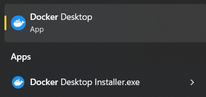
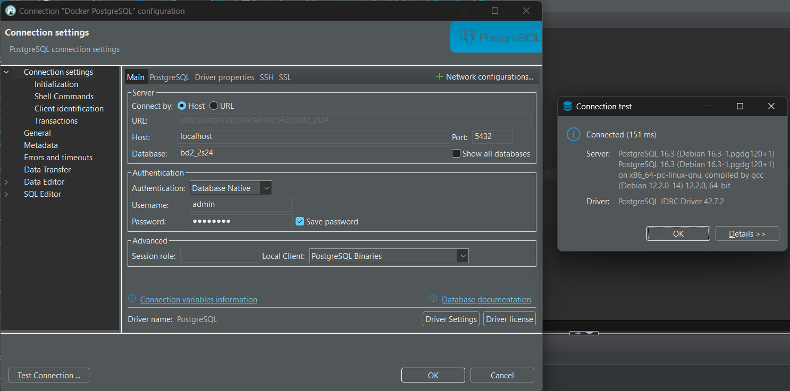

## Instalación de herramientas

### Cliente SQL


### Docker Desktop (Windows)

**Recomendación:** realizar instalación con wsl2 si esta en windows.



## Configuración Docker 

### Creación de carpetas y configuraciones iniciales


* **Carpeta pg1-path (obligatorio):** contiene la estructura de directorios y archivos de datos de PostgreSQL, crucial para el funcionamiento y almacenamiento de la base de datos.

* **Carpeta Scripts (obligatorio):** Contiene los scripts que usa el Dockerfile.

### Creación de Dockerfile

```dockerfile
# Usa la imagen oficial de PostgreSQL
FROM postgres:latest

# Variables de entorno para la configuración de PostgreSQL
ENV POSTGRES_USER=admin
ENV POSTGRES_PASSWORD=root1234
ENV POSTGRES_DB=bd2_2s24

## Instalar pgAgent para evitar error de extensión no encontrada (al menos en dbeaver aparece el error frecuentemente y puede ser molesto)

RUN apt-get update && apt-get install -y pgagent

# Script para crear la extensión pgAgent después de iniciar PostgreSQL
COPY create_pgagent_extension.sh /docker-entrypoint-initdb.d/create_pgagent_extension.sh
RUN chmod +x /docker-entrypoint-initdb.d/create_pgagent_extension.sh

## Fin de instalación de pgAgent

# Crear un directorio para scripts de inicialización (opcional)
# COPY init.sql /docker-entrypoint-initdb.d/

# Exponer el puerto PostgreSQL
EXPOSE 5432

# Comando para ejecutar PostgreSQL
CMD ["postgres"]
```

### Creación de imagen 

**Nota:** (ejecutar comando al mismo nivel de donde se encuentre el Dockerfile)

```sh
docker build -t nestjs-postgres .
```

### Creación de contenedor

**Nota:** los saltos de línea son con **`** porque se ejecuta comando en powershell. Tomar en cuenta cambio en cmd, unix/linux/bash, etc...

#### Plantilla: 
```sh
docker run -d \
  --name postgres \
  --network nestjs_hex_network \
  -v /ruta/local/a/tu/data:/var/lib/postgresql/data \
  -p 5432:5432 \
  nestjs-postgres
```

#### Ejemplo:

```bash
docker volume create nestjs-hex-pg

docker run -d \
  --name postgres \
  --network nestjs_hex_network \
  -v nestjs-hex-pg:/var/lib/postgresql/data \
  -p 5432:5432 \
  nestjs-postgres
```

## Configuración y prueba de conexión



